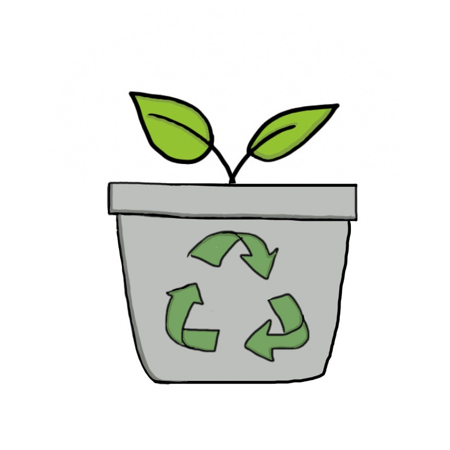

# CRIS

CRIS (Compost Recognition Image Software) is an app that seeks to help users make environmentally-friendly decisions by providing
a convenient way for users to find tips and information about different items (food, scraps, other discards) by simply snapping
a picture.

Written in Javascript on React Native, CRIS runs on iOS, Android, and desktop platforms.  Image labelling is done using
Google Cloud APIs.  The API key has since been removed from the source code and deactivated; 

CRIS was created by Brandon Gong, Abhishek Menothu, and Sruti Gandreti as a submission in the 2019 Congressional App Challenge,
Tennessee Congressional District 8 (TN-08).  It is open-source under the MIT License.
